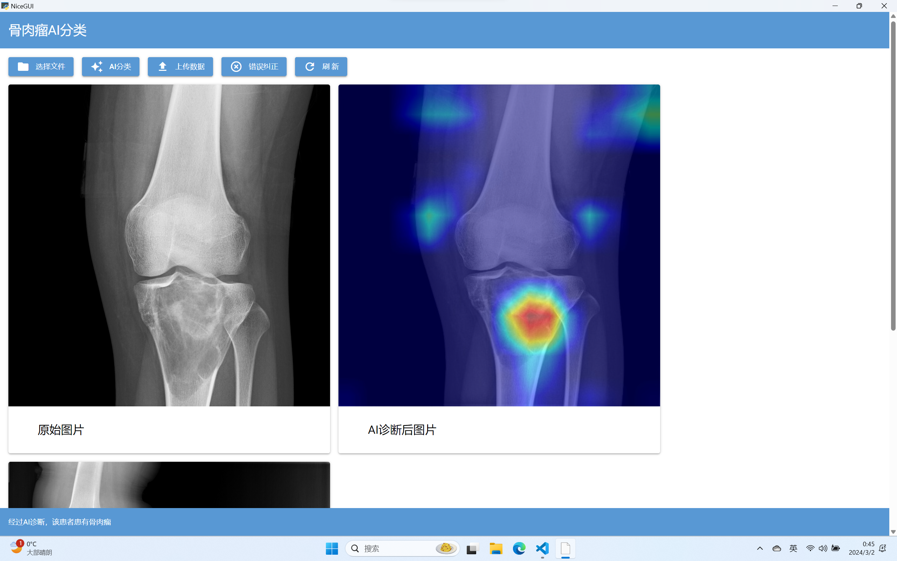

**高精度影像分析：系统能够识别X线片上的微小变化，如骨皮质破坏、不规则骨形成等，这些都是骨肉瘤的关键指标。通过精确的图像处理和模式识别，AI系统能够辅助医生发现潜在的恶性病变**

# 多部位诊断
**多部位支持：无论是长骨、短骨还是扁平骨，该系统都能够进行有效的分析和诊断，覆盖了骨肉瘤可能出现的各种部位。**
**病灶区域定位：AI系统不仅能够识别出异常区域，还能精确定位病灶的位置和范围，为后续的活检和治疗提供重要信息。**

# 本地软件界面

# 微信小程序端
**医生可以通过小程序即时上传X线影像，系统将迅速提供初步的分析结果，辅助医生进行初步筛查和诊断。**
